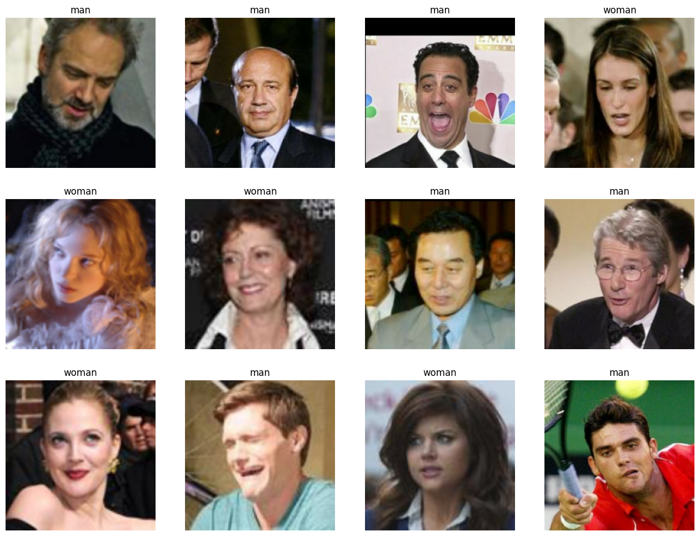
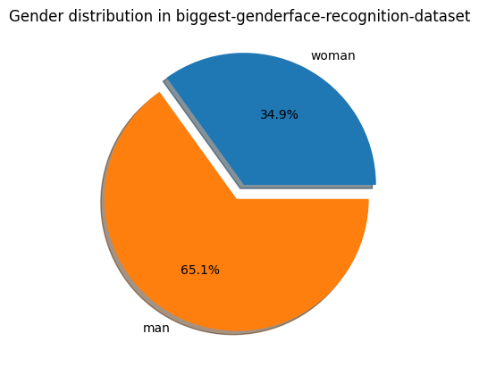
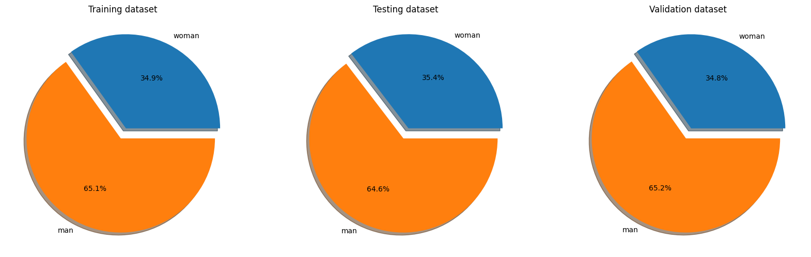
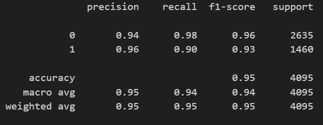
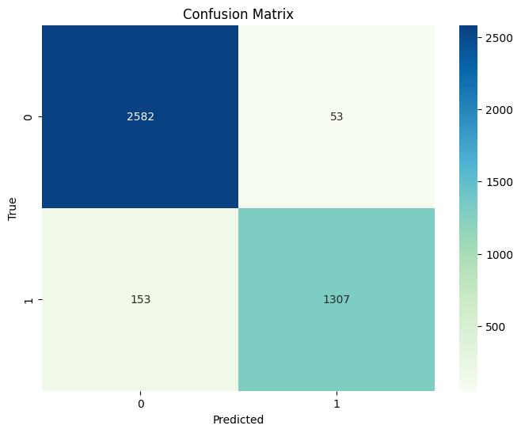
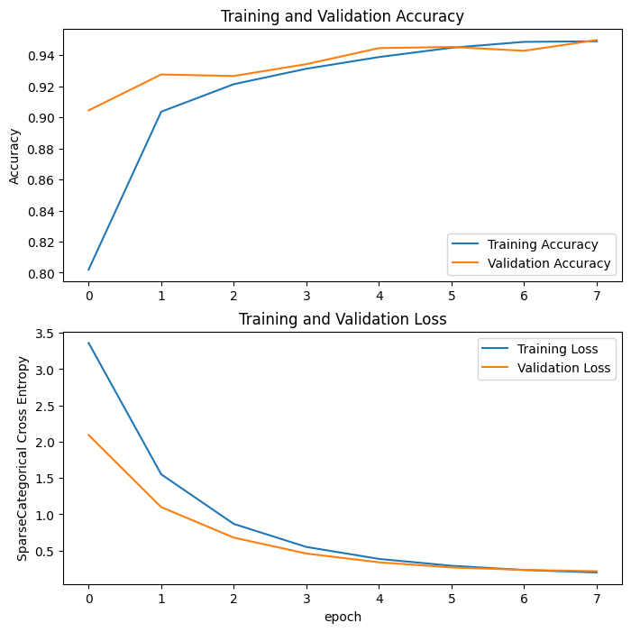
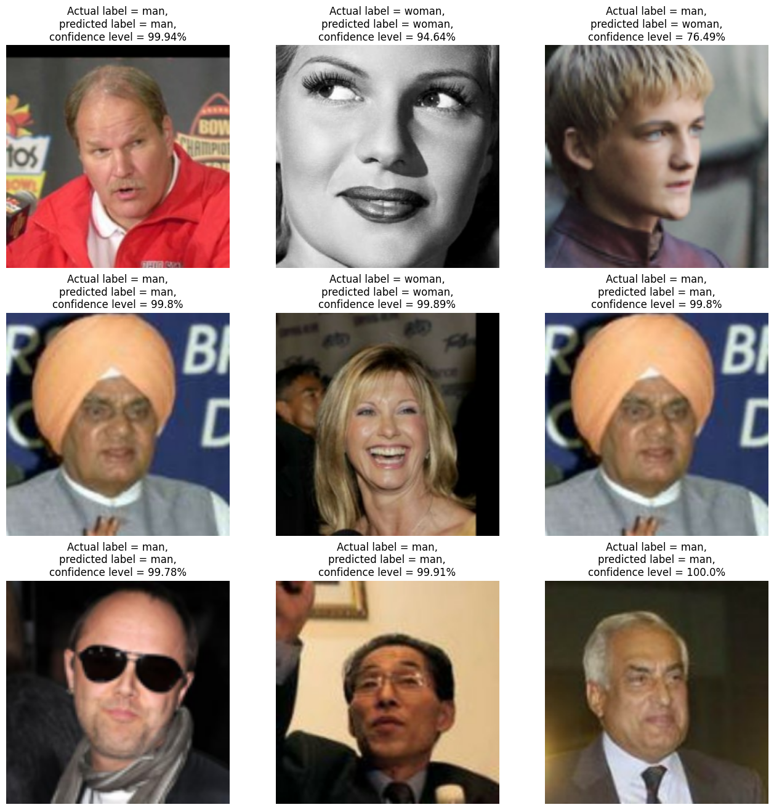
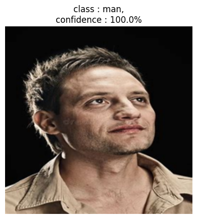
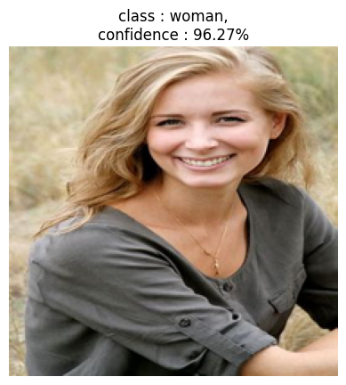

# Face Recognition Model - Detailed Implementation Documentation

## Table of Contents
- [Originality and Approach](#originality-and-approach)
- [Model Implementation Process](#model-implementation-process)
- [Results Analysis](#results-analysis)

---

## Originality and Approach

This section demonstrates creativity in solving the face recognition problem through various advanced techniques.

### 1. Enhanced Data Augmentation

To make the model more robust and capable of generalizing better to unseen data, a wide range of data augmentation techniques were included. This included random flipping, rotation, zooming and contrast adjustments. This helps the model learn more invariant features and improves its performance on real-world data.

### 2. Checkpoint Callback

To ensure that the best-performing model is saved during training, the **Checkpoint Callback** was implemented. The main purpose of the Checkpoint Callback is to monitor the validation loss and save the model with the lowest validation loss. This ensures that even if the model starts to overfit or perform worse in later epochs, we still retain the best version of the model based on its performance on the validation set.

### 3. Advanced Visualization

To better understand the model's performance and to check for overfitting, the training history and predictions were visualized:

- **Training History Visualization**: Plotted the training and validation accuracy and loss to monitor the model's performance over epochs.
- **Prediction Visualization**: Displayed the original images along with the actual and predicted labels, and their probabilities. This helps in qualitatively assessing the model's performance.

### 4. Model and History Saving

To ensure the trained model and its history are available for future use, they were stored using Python's pickle module. This way, the model can be reloaded and used for predictions on new images without retraining.

### 5. Performance Evaluation

To evaluate the model's performance comprehensively, a classification report and confusion matrix were generated. These metrics help understand the model's precision, recall, F1 score, and accuracy across different classes. Additionally, the confusion matrix visualizes the number of true positive, true negative, false positive, and false negative predictions.

### Summary

By incorporating enhanced data augmentation, custom callbacks, advanced visualizations, and comprehensive performance evaluation, this implementation demonstrates creativity and a deep understanding of the problem. This approach not only improves model performance but also provides valuable insights into its behavior and robustness, making the solution more effective.

---

## Model Implementation Process

### Dataset Preparation

#### 1. Loading the Dataset
- Used TensorFlow Datasets to load and prepare the dataset

**Random images in the dataset:**

**Class Distribution:**

**Dataset Balance Analysis**: The dataset is not imbalanced as the minority class represents more than 30% of the data.

#### 2. Data Augmentation
Applied augmentations like random flips, rotations, zooms, and contrast adjustments to enhance robustness.

#### 3. Data Preprocessing
- Resized images to 224x224 pixels
- Normalized and batched the data

---

### Model Architecture

#### 1. Base Model
- Utilized VGG16 architecture pre-trained on ImageNet

#### 2. Freezing Layers
- Initial layers of VGG16 were frozen to retain pre-trained weights

#### 3. Custom Layers
- Added global average pooling layer
- Two dense layers with ReLU activation and dropout for regularization
- Output layer with two neurons and softmax activation for binary classification

**Model Summary:**

---

### Compilation and Training

#### 1. Loss Function
- Used sparse categorical cross-entropy for binary classification

#### 2. Optimizer
- Adam optimizer with a learning rate of 0.0001

#### 3. Metrics
- Evaluated model performance using accuracy

**Dataset Split for Training, Testing and Validation:**

---

### Callbacks

#### Checkpoint Callback
- **Purpose**: Save the best model based on validation loss
- **Implementation**: ModelCheckpoint monitored validation loss and saved the model with the lowest validation loss

---

### Model Training

- Trained on the training dataset
- Validated on the validation dataset
- Evaluated using various metrics

---

### Performance Evaluation

- Generated a classification report and confusion matrix
  - **Metrics**: Precision, recall, F1 score, accuracy
  - Visualized true positive, true negative, false positive, and false negative predictions

---

### Advanced Visualization

- Visualized training history by plotting training and validation loss and accuracy over epochs
- Displayed example predictions with actual and predicted labels

---

## Results Analysis

### Classification Report

### Confusion Matrix

**Analysis**: The face recognition model shows robust performance with high accuracy, precision, recall, and F1-scores across both classes. The results indicate that the model is well-trained and capable of effectively distinguishing between men and women. The confusion matrix confirms that the model makes relatively few mistakes, and the classification report highlights the model's ability to handle class imbalance effectively. Further fine-tuning and additional data augmentation could potentially enhance the model's recall for the minority class (women).

---

### Training and Validation Metrics

**Analysis**: The graph is encouraging! The training and validation accuracy curves are both increasing, indicating the model is effectively learning from the data. Importantly, the validation accuracy is keeping pace without drastic fluctuations, suggesting the model is generalizing well and avoiding overfitting. This means the model is likely to perform well on unseen data, not just the training examples it's been shown. The loss curves also support this, with both decreasing steadily. Overall, these findings suggest a well-performing model that can learn and generalize effectively.

---

### Sample Predictions

**Test Dataset Predictions with Actual Labels and Probabilities:**

---

### Real-World Testing

**Images downloaded from internet and predicted using trained model:**

---

## Conclusion

This implementation successfully demonstrates:
- Effective use of transfer learning for face recognition
- Robust data augmentation strategies
- Proper model evaluation and monitoring
- Strong generalization capabilities
- High performance on both validation and real-world images

The model achieves excellent results with minimal overfitting and demonstrates the ability to correctly classify unseen images from the internet, validating its real-world applicability.